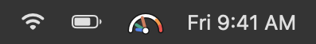
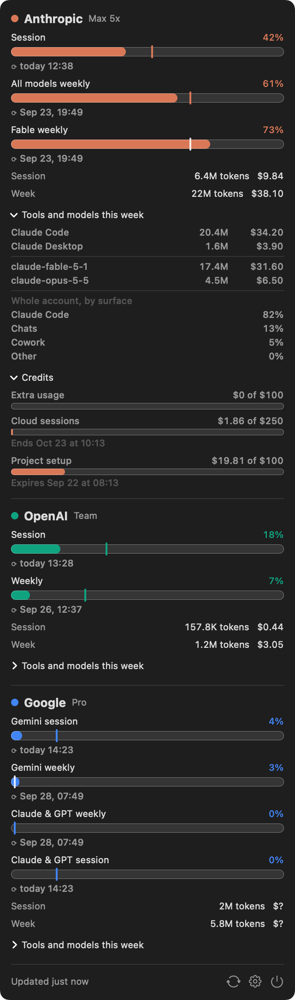
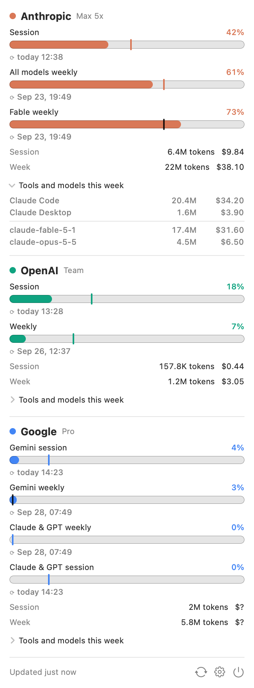
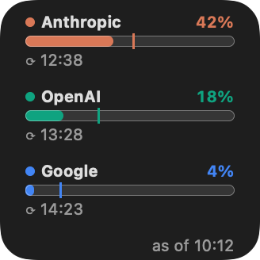
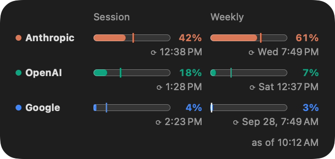
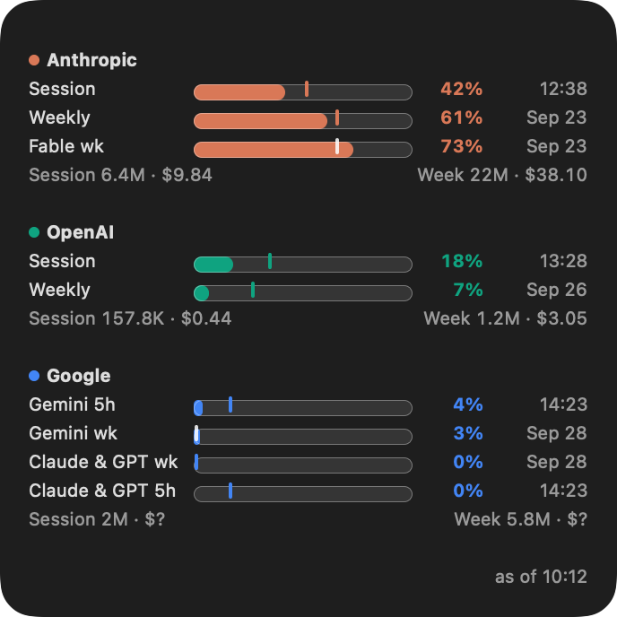
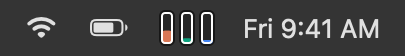
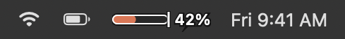

# Tokenometer

A macOS menu bar app and desktop widget that shows how much of your AI coding assistants' usage limits you have used. A tiny gauge in the menu bar with one hand per provider (or one bar per provider, your choice); session and weekly bars, spend, and a per-tool breakdown in the menu; the same on a widget.

<p align="center"></p>

It reads the logs that Claude Code, Claude Desktop, Codex, Gemini CLI, and Antigravity already write on your Mac, and gets each provider's percent-of-limit from that provider's own tool: Codex's logs, Antigravity's local server, and for Claude a separate Claude Code mod, usage-reporter, that has Claude Code ask on its own login. It never wraps or proxies an agent session, it never touches your Claude login, and nothing about your usage leaves the machine. See [PRIVACY.md](PRIVACY.md) and [SECURITY.md](SECURITY.md) for exactly what is read and what is sent.

## Requirements

- macOS 27.
- For Claude's usage bars: Claude Code 2.1.287 or later (the first release Anthropic supports mods on; the mod is known to run on 2.1.251) with the [usage-reporter](https://github.com/tksunw/usage-reporter) mod. The mod is required, not optional: Tokenometer does not read your Claude login, so without it there is no source for Claude's percentages and you get spend only. Use 0.3.0 or later; an older version drives the bars but not the by-surface rows. See [Install](#install).
- Codex and Antigravity need nothing extra.

## What it shows

<p align="center"> </p>

For each provider:

- **Session** and **weekly** bars, as the provider reports them. Claude's 5-hour and 7-day windows, Codex's primary and secondary windows, Google's per-group 5-hour and weekly windows.
- **Scoped** bars where the provider has them: Claude's per-model weekly cap ("Fable weekly"), Antigravity's second model group ("Claude and GPT").
- A **pace tick** on every bar marking how far through the window the clock is. The fill stays in the provider's color while usage is at or behind the tick. Ahead of it, amber from 75% and red from 90%.
- **Spend**: tokens and dollars for the session and the week. On a subscription the dollar figure is what the same tokens would have cost at API rates, labeled as such; the subscription is the real bill.
- **Tools and models** this week, under a disclosure. Those rows are summed from this Mac's logs. For Claude the disclosure also shows the week split by surface (Claude Code, Chats, Cowork, Other) for the whole account, as Anthropic reports it, which covers your other devices and claude.ai chat too.

Providers appear only when their logs exist on the Mac. If a source cannot be refreshed, the bar keeps its last value, dims, and shows why on hover.

### Widget

Small shows the session bar per provider. Medium shows session and weekly side by side. Large shows every window and spend. Reset times sit beside each bar on all three sizes.

<p align="center"> </p>
<p align="center"></p>

Screenshots are rendered from the app's own views with sample data (`swift run mockups`), so they match the real thing pixel for pixel but not your numbers.

## Install

1. Download `Tokenometer-<version>.dmg` from the [latest release](https://github.com/tksunw/Tokenometer/releases/latest) and open it.
2. Drag Tokenometer onto the Applications folder in the installer window, then open it from Applications. The app and the disk image are Developer ID signed and notarized. A plain zip of the app is on the release page too.
3. It lives in the menu bar only; there is no Dock icon. Click the bars for the menu, the gear for Settings.
4. For the widget: right-click the desktop, Edit Widgets, search Tokenometer.
5. If you use Claude, install the usage-reporter mod (below). Claude's usage bars do not work without it; only spend does.

### usage-reporter

Tokenometer does not read your Claude login. Claude's percent comes from [usage-reporter](https://github.com/tksunw/usage-reporter), a separate Claude Code mod that asks Claude Code for your usage and writes it to `~/.claude/usage-reporter/usage.json`, where any tool can read it. Set it up once per Mac. Each block below can be pasted into Terminal as is.

**1. Install the mod.**

```bash
mkdir -p ~/.claude/mods
git clone https://github.com/tksunw/usage-reporter ~/.claude/mods/usage-reporter
```

**2. Tell Claude Code to load that folder.** This adds one line to `~/.claude/settings.json`, creating the file if there is none and leaving everything else in it alone:

```bash
f=~/.claude/settings.json
[ -f "$f" ] || echo '{}' > "$f"
jq '.env.CLAUDE_CODE_PLUGIN_DIRS = "~/.claude/mods"' "$f" > "$f.new" && mv "$f.new" "$f" || rm -f "$f.new"
```

To do it by hand instead, add `"CLAUDE_CODE_PLUGIN_DIRS": "~/.claude/mods"` to the `env` block of that file. If you already set that variable to another folder, add `~/.claude/mods` to it after a colon rather than running the command, which would replace it.

**3. Start a new Claude Code session.** A session that was already open does not load the mod. Until the mod reports, the Anthropic bars are missing or marked stale with a warning triangle.

**Check that it works.** The first command should show the mod as loaded; the second prints when it last reported and the percentages:

```bash
claude plugin list | grep -A3 usage-reporter
jq -r '.at, (.windows[] | "\(.kind) \(.label // "all") \(.percent)%")' ~/.claude/usage-reporter/usage.json
```

**Update the mod.** Tokenometer updates itself, but the mod does not. Pull, then start a new Claude Code session:

```bash
git -C ~/.claude/mods/usage-reporter pull
```

**Remove the mod.**

```bash
rm -rf ~/.claude/mods/usage-reporter
```

This setup works in the terminal and in the Claude desktop app's Code sessions alike. Cloning into `~/.claude/skills/usage-reporter` needs no settings line, but only terminal sessions load mods from there, so usage from the desktop app would never be reported.

The bars update while a Claude Code session is running: session and weekly after each turn, the model-scoped bar at most every five minutes. Needs a Claude Code version with mods (2.1.287 or later). Tokenometer needs usage-reporter 0.3.0 or later for the by-surface rows in the menu; with an older mod those rows are absent and everything else works.

Updates: the app checks GitHub Releases once a day (Sparkle) and offers new versions; turn that off in Settings or check manually from the menu. The first time a new version launches it restarts the system's widget service once, so the widget picks up the new version; all your widgets redraw for a moment.

## Where the numbers come from

| Provider | Tools read | Spend (tokens, cost) | Usage percent |
|---|---|---|---|
| Anthropic | Claude Code (including subagents), Claude Desktop | `~/.claude/projects/**/*.jsonl` and Claude Desktop's local agent sessions | The file the usage-reporter mod writes: Claude Code calls the endpoint behind `claude /usage` itself, and the mod saves the answer |
| OpenAI | Codex | `~/.codex/sessions/**/*.jsonl` | The same files: Codex writes its rate limits into every session log |
| Google | Antigravity (IDE and `agy` CLI), Gemini CLI | Antigravity's conversation databases, Gemini CLI chat recordings | The Antigravity hub's local language server, the same source the IDE and `agy` show |

Refresh happens when a log file changes (FSEvents) and every 60 seconds as a backstop. Antigravity's local server is asked at most every two minutes while you are active and every five minutes when idle. Claude's numbers are as fresh as the mod's last report; if the logs run more than fifteen minutes ahead of it, the bars dim and say so.

### Plan versus metered accounts

A subscription (Pro, Max, Team, ChatGPT Team, Google AI Pro) has usage windows, so you get percent bars. An API key or Enterprise account is billed per token and has none; for those Tokenometer shows spend, and a bar only if you set a dollar budget per window in Settings. Detection is automatic with an override per provider.

## Settings

Launch at login. Menu bar style: gauge (one hand per provider, long to short in provider order, rim amber from 75% and red from 90%), bars (one per provider), or a horizontal session bar with its percent that either cycles through your providers every 10 seconds or stays on one you pick.

<p align="center"> </p>

Menu background: a slider from translucent to solid, for how much of the desktop shows through the menu; mostly solid by default, since the bare translucent panel is hard to read over a dark desktop.

Per provider: enabled or not (so a leftover `~/.gemini` from a cancelled plan can be ignored), show even when no logs are found, plan or metered override, session and weekly budgets. Notifications when a session or weekly window crosses 90% while ahead of pace, and again when it resets, off by default.

## Build from source

Xcode 27. The Xcode project is generated from `project.yml` with [xcodegen](https://github.com/yonaskolb/XcodeGen) and committed, so you only need xcodegen if you change the project definition.

```bash
git clone git@github.com:tksunw/Tokenometer.git && cd Tokenometer
xcodebuild -project Tokenometer.xcodeproj -scheme Tokenometer -configuration Debug -destination 'platform=macOS' build
cd TokenometerCore && swift test          # parsers, pricing, aggregation, clients
swift run tokenometerctl                  # prints what the app would show on this Mac
```

Signing is set to a Developer ID identity for team `F5ED28X889`; change `DEVELOPMENT_TEAM` and the App Group prefix in `project.yml` (and `SnapshotStore.appGroup`) to build under your own team.

Layout: `TokenometerCore/` is a Swift package with the model, log parsers, collectors, pricing table, aggregation, and the usage clients, tested against scrubbed fixture logs. `Tokenometer/` is the menu bar app, `TokenometerWidget/` the WidgetKit extension. `docs/adr/` records the design decisions; `GLOSSARY.md` the vocabulary.

## Limitations

- Google percent needs an Antigravity process running (the hub app normally sits in the background). Without one the Google bars go stale with that reason.
- Pricing is a table in `Pricing.swift`. A model with no row shows its tokens and a `$?`; pull requests with published rates welcome.
- The sources of usage percent are undocumented and can change. When one breaks, the bar goes stale rather than wrong.
- Tokenometer is unofficial and not affiliated with Anthropic, OpenAI, or Google. It reads no provider login and sends nothing to any provider. Claude's percent comes from Claude Code itself through the usage-reporter mod, calling an endpoint Anthropic does not document, and Google's comes from an undocumented local interface of Antigravity. Either can change or be withdrawn. Use it at your own risk; each provider can be switched off in Settings.
- One account per provider per Mac.

## License

MIT. See [LICENSE](LICENSE).

The agent skills under `.agents/skills/` come from [mattpocock/skills](https://github.com/mattpocock/skills), MIT, copyright Matt Pocock. Their license is in [.agents/skills/LICENSE](.agents/skills/LICENSE).
